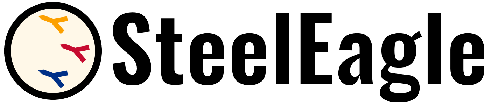

<!--
SPDX-FileCopyrightText: 2023-2025 Carnegie Mellon University - Satyalab

SPDX-License-Identifier: GPL-2.0-only
-->

# SteelEagle: Edge-Enabled Drone Autonomy

## Introduction

SteelEagle is a software suite and edge orchestration system that transforms
programmable commercial off-the-shelf (COTS) robotics platforms into
fully-autonomous vehicles. By leveraging COTS economies of scale, SteelEagle
can emulate the performance of expensive, onboard compute-based platforms on
light, inexpensive hardware.

The SteelEagle suite is equipped with a universal API which unifies disparate
control SDKs under one programming scheme. This API is robot agnostic and can
be used with any kind of programmable robotics hardware, including custom
builds. Any drone that is SteelEagle API compatible can plug into the
SteelEagle unified autonomy development stack which promotes code sharing and
heterogeneous device collaboration. A visual mission scripting tool is also
available to give non-programmers an easy way to interact with autonomous
robots.

SteelEagle's edge processing pipelines allow drop-in drop-out configuration of
AI backends, deployed in widely-used development environments instead of on
embedded hardware. This makes SteelEagle an ideal testbed for AI robotics
applications that need to quickly iterate and field deploy.

## Documentation

[**Quickstart**][quickstart] | [**Docs**][docs]

[quickstart]: https://cmusatyalab.github.io/steeleagle/getting_started/overview/
[docs]: https://cmusatyalab.github.io/steeleagle/

## Why Use SteelEagle?

### :money_with_wings: Low Cost

SteelEagle can be used with mass-market consumer robots which are extremely
cost-optimized. This makes acquisition easier and cheaper than custom-built or
niche products. It can also make swarm operations more economically feasible
for constrained budgets.

### :small_airplane: Accessible

SteelEagle robots are designed to abstract away as much low-level control code
as possible allowing users to focus on developing high-level tasks.
Non-programmers can use the visual scripting API to design complex mission
behavior without writing a single line of code. Programmers can use the Task
Creator SDK to easily build out new functionality, and can use the Backend SDK
to rapidly deploy new AI models across a robot fleet.

### :baby_chick: Lightweight

Because SteelEagle robots rely on the edge for intelligence, they don't need to
carry heavy onboard compute resources. This drives down weight, something which
is particularly important for UAVs (unmanned aerial vehicles) due to [strict
weight regulations][faa_weight]. SteelEagle enables autonomy on aircraft
significantly smaller and lighter than traditional autonomous UAVs.

[faa_weight]: https://www.faa.gov/uas/commercial_operators/operations_over_people

### :minidisc: Portable

SteelEagle is robot agnostic by design, able to accommodate any robot with a
SDK. It supports heterogeneous collaborative robot swarms, and it gives users
the ability to easily port code from one platform to another. While SteelEagle
is unlikely to match the performance of purpose-built autonomous systems, its
design allows for missions that pair such systems with smaller, cheaper helpers
which can improve mission outcomes.

### :eyes: BVLOS (Beyond Visual Line-of-Sight)

SteelEagle robots can communicate with an edge backend using any type of
underlying radio communication, including LTE, without human supervision
(beyond visual line-of-sight, or BVLOS for short). Operations like this are
important for remote surveillance, especially in adversarial environments.

### :electric_plug: Access to Powerful Compute

SteelEagle robots have access to much more powerful computation over the
network than most mobile robots have onboard, due to their access to edge
servers. Although edge servers are not as powerful as cloud servers, they are
far more capable than any mobile computer and can deliver high-quality AI
results with relatively low latency.

## License

Unless otherwise stated in the table below, all source code and documentation
are under the [GNU Public License, Version 2.0][gpl2]. A copy of this license is
reproduced in the [LICENSE](LICENSE) file.

Portions from the following third party sources have been modified and are
included in this repository.  These portions are noted in the source files and
are copyright their respective authors with the licenses listed.

| Project | Modified | License |
| ------- | -------- | ------- |
| [cmusatyalab/openscout][openscout] | Yes | Apache 2.0 |

[gpl2]: https://www.gnu.org/licenses/old-licenses/gpl-2.0.en.html
[openscout]: https://github.com/cmusatyalab/openscout

## Related Publications

- M. Bala, T. Eiszler, X. Chen, J. Harkes, J. Blakley, P. Pillai, and M.
  Satyanarayanan, "Democratizing Drone Autonomy via Edge Computing," *2023
  IEEE/ACM Symposium on Edge Computing (SEC)*, Wilmington, DE, USA, 2023, pp.
  40--52, doi: [10.1145/3583740.3626614](https://doi.org/10.1145/3583740.3626614).
- M. Bala, A. Chanana, X. Chen, Q. Dong, T. Eiszler, J. Xu, P. Pillai, and M.
  Satyanarayanan, "The OODA Loop of Cloudlet-based Autonomous Drones," *2024
  IEEE/ACM Symposium on Edge Computing (SEC)*, Rome, Italy, 2024, pp. 178--190,
  doi: [10.1109/SEC62691.2024.00022](https://doi.org/10.1109/SEC62691.2024.00022).
