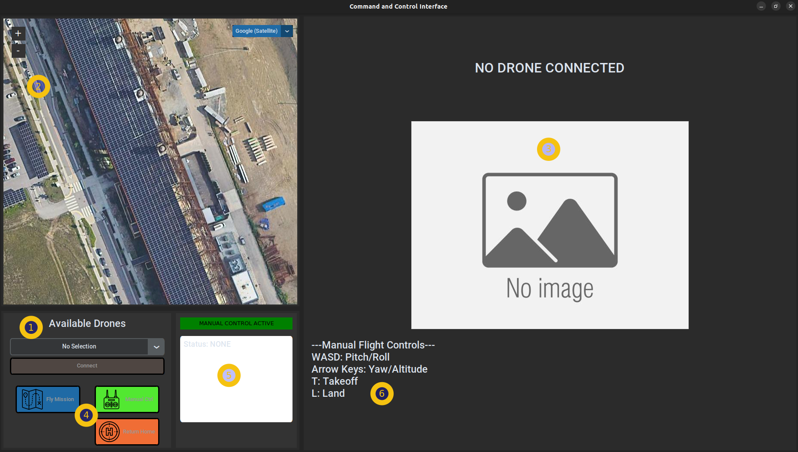

# Commander
Our ground control software, simply referred to as the **Commander**, is used to view stream and telemetry data from connected drones and to send them command message (e.g. manual control, return to home, send on autonomous mission). 
The current implementation runs in python and is based on [customtkinter](https://github.com/TomSchimansky/CustomTkinter).
An implementation using [streamlit](https://streamlit.io/) is a work-in-progress.

Typically the Commander is run by the drone pilot in the field, but in theory it can be run from anywhere with internet connectivity as commands are relayed through the internet backbone over LTE to the drone.

## Installation

The commander can be installed by installing the requirements: 

```sh
cd ~/steel-eagle/cnc/python-client/
python3 -m pip install requirements.txt
```

## Launching

```sh
cd ~/steel-eagle/cnc/python-client/
python3 gui_commander.py
usage: commander_client.py [-h] [-s SERVER] [-p PORT] [-l LOGLEVEL] [-ng]

optional arguments:
  -h, --help            show this help message and exit
  -s SERVER, --server SERVER
                        Specify address of Steel Eagle CNC server [default: cloudlet040.elijah.cs.cmu.edu
  -p PORT, --port PORT  Specify websocket port [default: 9099]
  -l LOGLEVEL, --loglevel LOGLEVEL
                        Set the log level
  -ng, --nogui          If specified, use the text prompt commander
```

At a minimum, you will need to provide the commander with the address of the machine where the CNC backend is running.

### Layout/Usage



The above screenshot details the layout of the Commander. The typical usage of the application is as follows: 

1. The 'Available Drones' list will be populated with any steel-eagle drones once they have connected to the backend either by launching the Android app (Java) or starting the supervisor script (Python). Select a drone from the list and then click the 'Connect' button.
2. After connecting to a particular drone, the map should be updated to center on the location of the drone and a icon representing the drone will be shown. The position/orientation of the icon will correspond to the current position/bearing of the drone. This will be automatically updated over time. You can change the tile server using the dropdown menu in the upper right corner of the map.
3. Once the drone has connected to the backend, it should also start sending its video stream which will be displayed here.
4. The buttons here can be used to send control messages to the drone. By default, the drone is initially in manual control mode (see #6). The drone can be instructed to start an autonomous mission by using the 'Fly Mission' button. When an autonomous mission is ongoing, the 'Return Home' and 'Manual Ctrl' buttons can be used to wrest control of the drone at any time.
5. This pane will display the current status of the drone. The green box that says 'Manual Control Active' will be displayed when the pilot has manual control. It will change to 'Autonomous Control Active' when instructed to fly a mission script. It will also indicate that a Return to Home is in progress if the RTH button is pressed.  The text box below will contain the current telemetry data from the drone including lat/lon, altitude, bearing, magnetometer status, and Wifi RSSI.
6. The manual controls displayed here can be entered on the keyboard to manually pilot the drone while manual control is active.

When multiple drones are connected, you can switch drones by selecting a different drone from the 'Available Drones' list and hitting the connect button.
