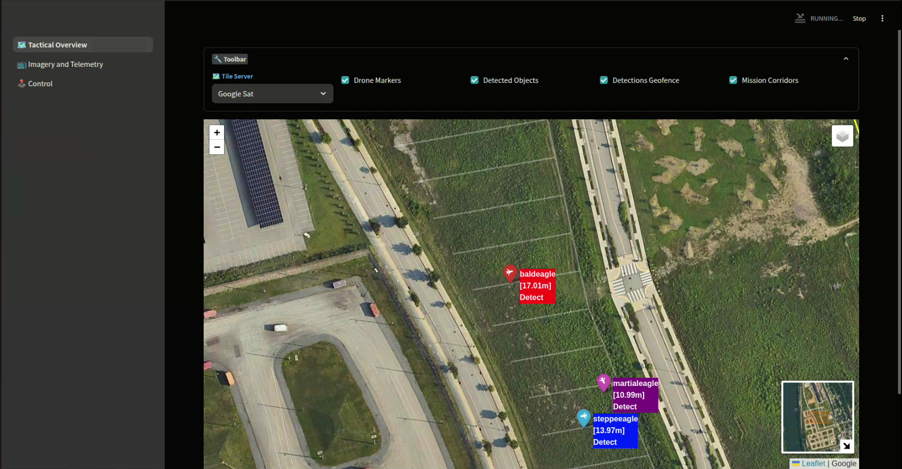
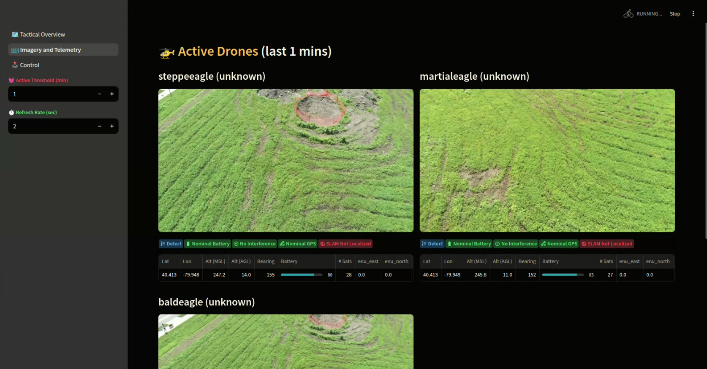
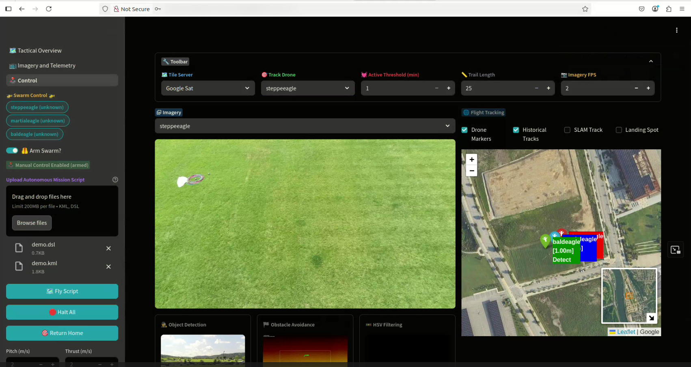

SteelEagle utilizes a custom Ground Control Station which is currently written in [Streamlit](https://streamlit.io) which is a pure python web frontend. The SteelEagle GCS allows a pilot-in-command (PiC) to control one or more vehicles manually, send them on autonomous missions, and view telemetry and image data from connected vehicles.

## Pages

### Tactical Overview
On the left of the GCS, there is a sidebar which has several pages. The default page is the __Tactical Overview__. This page shows a large map with controls to show/hide various entities (vehicle markers, detected objects, geofence, and mission corridors). The toolbar also has a control to change the tileserver for the map. This toolbar as well as the sidebar can be collapsed.

* __Drone Markers__ - When enabled, markers will be placed at the latitude/longitude of each vehicles current location. The icon will face in the direction of the current heading.
* __Detected Objects__ - When the object detection engine finds objects that are above the confidence threshold, it will estimate a projection for the location of that object on the ground. A marker will be placed there which will indicate the class, the confidence value, and hovering over the marker will display the image associated with that detected
* __Detections Geofence__ - If enabled at runtime for the object detection engine, a geofence can be specified. This geofence will limit detections of objects to only those found within the geofence. If this box is checked, the associated geofence will be shown as a polygon on the map.
* __Mission Corridors__ - When executing a mission, the swarm controller will partition the waypoints associated with the KML file uploaded for the mission. The partitions can be shown on the map.

### Imagery and Telemetry

The __Imagery and Telemetry__ page displays: the video stream from each vehicle, a set of status icons (current mission task, warnings for sensors, etc), and a table of the most recent telemetry data; in a two-column layout. Controls are added to the sidebar to set the refresh rate and also the threshold for active vehicles.

### Control

Unlike the other two pages which are effectively passive, view-only pages, the __Control__ page allows a PiC to control one or more drones.  The main content of the page features:
* an imagery section which will display one vehicle's stream at a time in addition to the output from the cognitive engines
* a map which will display some key vehicle telemetry for all connected vehicles
* a toolbar to control various options

Many controls will also be added to the sidebar when viewing this page:
* a selection list of vehicles to manipulate
* a arm/disarm toggle
* a file uploader for an autonomous mission (a .dsl/.kml set)
* buttons to send vehicles on a mission, halt, or return to home
* sliders to adjust manual control parameters

#### Manual Flight Control
Vehicles can also be manually piloted (in unison if more than one is selected), by using a series of keyboard controls. When armed, and one or more drone is selected the following key mappings perform various actuations:

> __WARNING: Manual controls will only be sent if the 'Arm' switch is enabled. Also, commands will only be sent to those vehicles which are currently selected. Please take care when issuing manual controls.__

* t/g - Instructs selected vehicles to takeoff/land.
* w/s - Pitch forward/backward at the rate specified by the 'Pitch' slider
* a/d - Roll left/right at the rate specified by the 'Roll' slider
* i/k - Thrust up/down at the rate specified by the 'Thrust' slider
* j/l - Yaw left/right at the rate specified by the 'Yaw' slider

> __NOTE: The gimbal pitch can be manipulated in absolute terms by specifying the absolute angle using the slider.__

#### Mission Planning

Mission planning is currently done outside of the Streamlit GCS. For instructions on how to write a mission DSL script and produce a mission KML file in MyMaps, see the [Planning](../dsl/plan.md) page.

#### Autonomous Mission Control

In order to send selected vehicles on an autonomous mission, first the PiC must upload a mission script (.dsl) and an associated set of waypoints (.kml) file. Once these files are uploaded to the GCS, hitting the 'Fly Script' button with send the mission to the selected vehicles. Hitting the 'Halt All' button will stop the mission for all selected vehicles and cause them to hover. Manual controls can then be initiated once again.  Hitting the 'Return Home' button will initiate the return to home feature for all selected vehicles.
