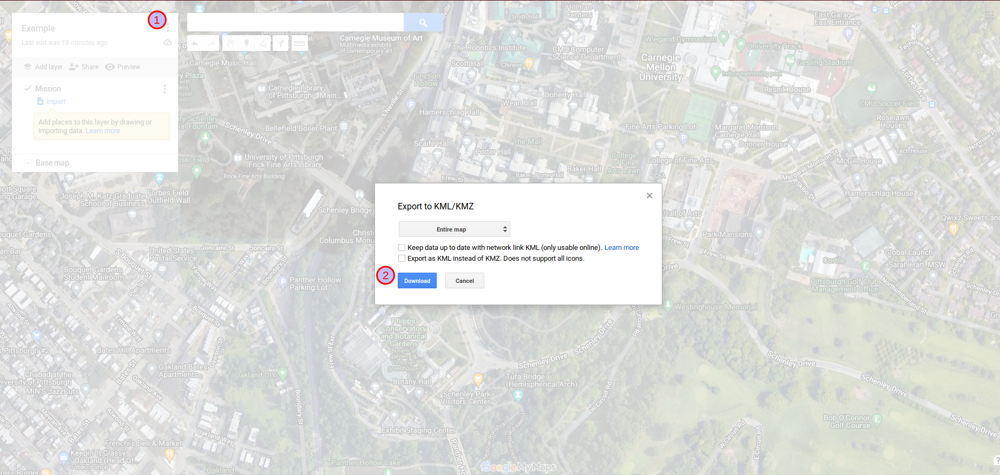

# Mission Planning

We leverage the drawing tools of [Google MyMaps](https://www.google.com/maps/about/mymaps/) to plan out missions for SteelEagle. MyMaps allows a user to draw lines and polygons representing waypoints and then attach a particular task specification to each by editing the description field. The entire mission can then be exported to a KML file which can be used as input into the [Hermes]({{ site.baseurl }}) parser and subsequently turned into a mission script (.ms).

## Drawing Lines/Polygons

1. The name of the mission and various layers can be configured on the left hand panel. New lines/polygons will appear here as they are drawn, and are associated to a particular layer.
2. Click the 'Draw a line' icon to begin drawing a line or polygon.
3. Clicking anywhere on the map will create a vertex. Click the same vertex again to stop drawing a line segment or click the starting vertex to end a polygon.

## Adding Task Specifications

Once a line or polygon is created, a text box will be displayed for a description. Enter a task and its associated parameters. See the [Task Stubs]({{ site.baseurl }}) page for a list of existing tasks. The description can be editing at any time by clicking on the pencil icon. The style of the line/polygon can be changed using the paint bucket icon.

Multiple lines/polygons can be added to the map, each with their own task specification. The tasks will be executed in the order they appear in the list (see #1 in the image above). In the above image, that would mean **Area1** is executed first, then **GreenArea**, and finally **Red**. The order can be rearranged by dragging the names of the placemarks in the list at the left.  

## Exporting to KML

1. Click the 3-dots icon and go to 'Export to KML/KMZ'.
2. Select download. Optionally you can check to the box to export KML instead of KMZ (KMZ is a zipped format so it is smaller, but not human readable). The filename of the exported KML document will match the name that was given to the map and will be located in the Downloads directory.
