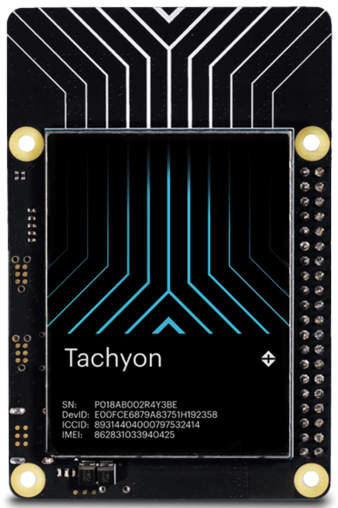

## Legend

 
Field tested in multiple real-world environments.

 
Support for this platform is on our roadmap.

## Onion Omega2 LTE

The [Onion Omega2 LTE](https://onion.io/store/omega2-lte-na/) includes a 4G LTE modem on a single-board computer that runs OpenWRT. It is traditionally used in IoT environments as a gateway. In SteelEagle we use it onboard the vehicle to act a bridge between the vehicle (WiFi) and the edge node (LTE). It can be powered via USB-C or from a small LiPO battery.

## Android Smartphones

For vehicles that are large enough to carry 200-300g, an Android smartphone can be used as a payload. Android devices can also be used as part of the RC on the ground. In this configuration, the SteelEagle vehicle code runs on the smartphone and leverages the communication channel of the RC to communicate with the vehicle.

## Particle Tachyon

The [Particle Tachyon](https://www.particle.io/tachyon/) is a 5G + AI single-board computer than can run Ubuntu.
