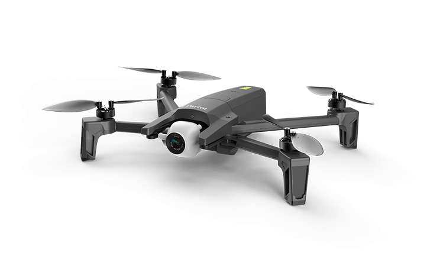
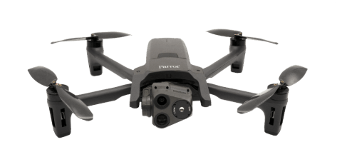
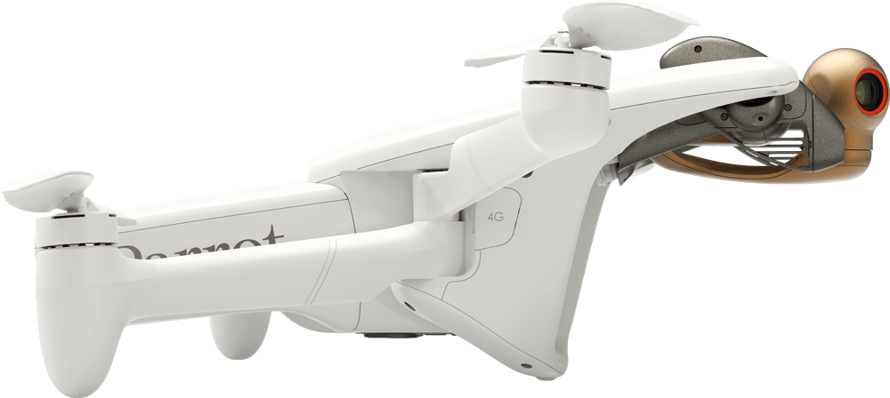
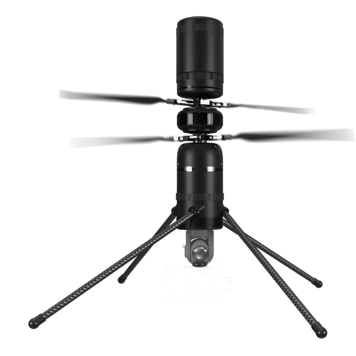

| Manufacturer | Model | Badges | Cost | Weight | Info |
|---|---|---|---|---|---|
|**Parrot**| Anafi |    | $400 | 320g | Discontinued drone with a single 1080p/4K camera. |
|**Parrot**| Anafi USA |    | $7000 | 550g | Government ISR drone with a 4K camera and FLIR thermal sensor. |
|**Parrot**| Anafi Ai |    | $5350 | 898g | ISR drone with stereo cameras, onboard obstacle avoidance, and 4G connectivity. |

## Parrot Drones SAS

French [manufacturer](https://www.parrot.com) of ISR drones, based in Paris.

### ANAFI
  

Discontinued sub-$500 photography drone. Weighs 350g. Monocular camera.

### ANAFI USA/GOV
   

500g. Thermal and RGB cameras. Blue UAS compliant.

### ANAFI USA MIL
 

Microhard version of the ANAFI USA.

### ANAFI UKR

### ANAFI Ai

Integrated LTE. Stereo and RGB cameras.

## Modal AI
[Manufacturer](https://www.modalai.com) of development drones and autopilot/compute boards.

### Starling 2 MAX
  

Onboard compute from VOXL board. Optional LTE/5G module.

## Sky Rocket

### Sky Viper V2450GPS
 

Discontinued photography drone with Ardupilot and GPS.

## Ascent Aerosystems

### Spirit
    

Modular coaxial copter capable of carrying various payloads.

## DJI

### DJI Mini 3/4 Pro
 

## Vantage

### Vantage Vesper
 

### Vantage Trace
 

## Teal

### Black Widow
 
