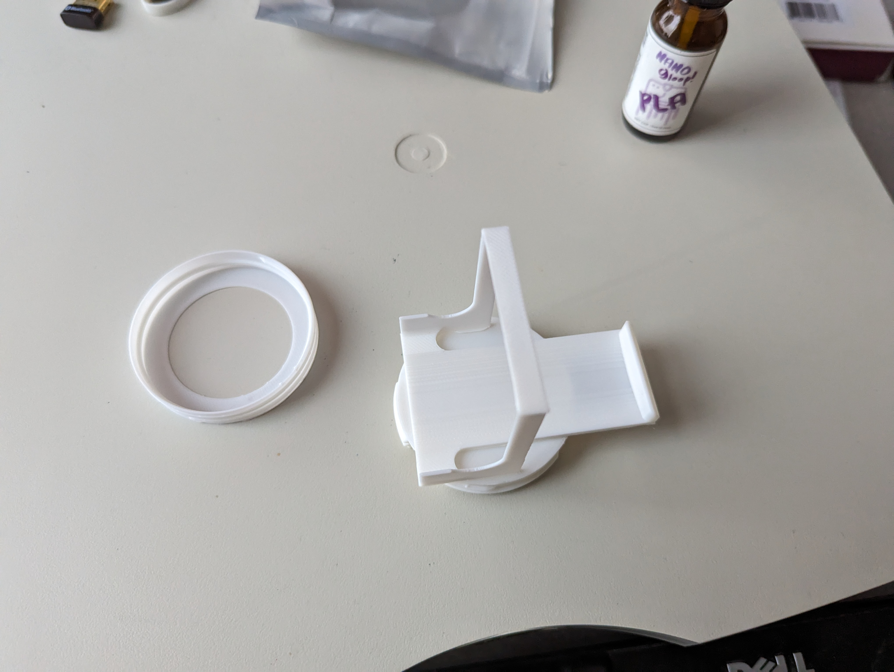
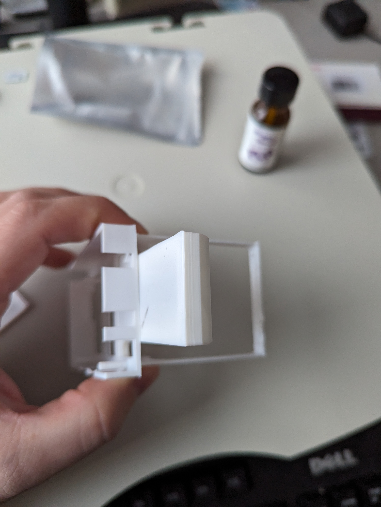
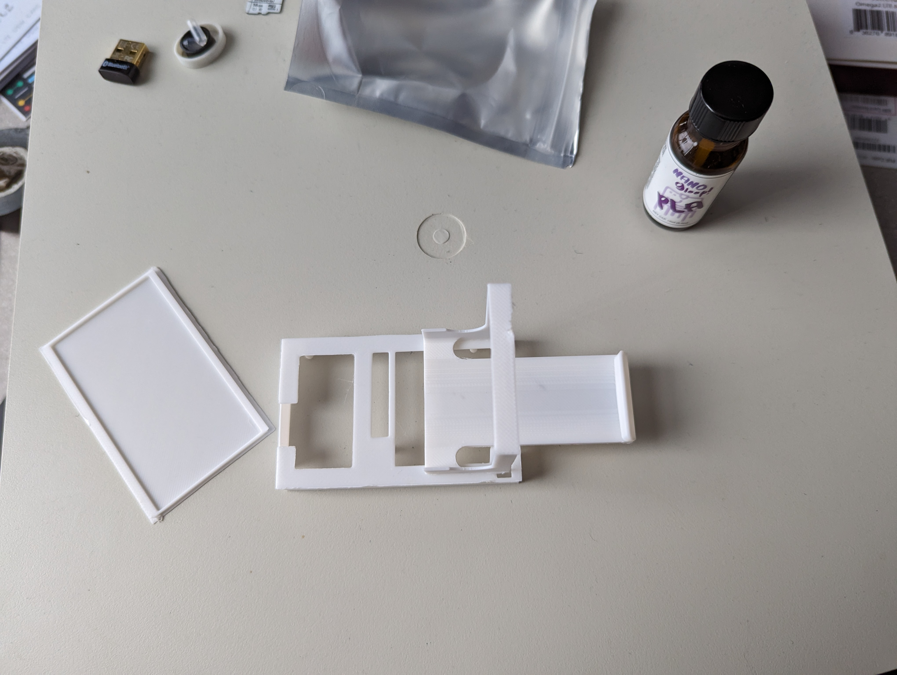

# Harness Printing

In order to get our payloads (either the Samsung Galaxy 4 Watch or the Onion Omega LTE) to be carried by the ANAFI drones, we have created a number of modular pieces that can be printed and fused together using [3D Gloop](https://www.3dgloop.com/). We printed our harnesses in PLA, but prtining in ABS should also work, provided you get the correct version of 3D Gloop.

{: .warning }

The Parrot Anafi has a safe payload cutoff of around 60g. Ensure that the overall payload, including the harness, is below this threshold.

## OpenSCAD

We used OpenSCAD to allow us to programmatically generate individual .stl files which can then be sent to a printer. OpenSCAD can be installed with apt:

```sh
$ sudo apt install openscad
```
Unless you are modifying the ANAFI designs to print a harness for a different model drone, you should not need to change any of the .scad files in the /stl directory.

## Components for Galaxy Watch 4

* lite_body_clip.stl ***OR*** anafi_usa_body_clip.stl (Depending on whether you are printing for ANAFI or ANAFI USA)
* lite_watch_case.stl
* lite_watch_cap.stl

## Components for Onion Omega LTE

* lite_body_clip.stl ***OR*** anafi_usa_body_clip.stl (Depending on whether you are printing for ANAFI or ANAFI USA)
* drone_onion_lid.stl
* drone_onion.stl


## 3D Printer Settings

Since we are optimizing for weight, we have used %5 infill. The .stl files listed above should already be arranged to reduce the amount of support material that is needed.

## Assembly

### Watch



1. In order to assemble the watch harness, line up the watch base with the harness body as shown.
2. Observe the areas that overlap; this is where Gloop needs to be applied.
3. Apply Gloop to both the bottom of the base and the top of the harness body and press the two pieces together as they were previously aligned.
4. Continue applying moderate pressure for about 30 seconds.
5. Allow 1 hour to fuse completely.

### Onion

{: .note }

The LTE module on the Onion Omega can interfere with the GPS of the ANAFI which is near the camera/gimbal. As such, care must be taken to orient the case properly and as far back on the clip as possible when Glooping the pieces together.


1. Layout the pieces of the harness as show in the first figure.



2. The onion base should be oriented so that the end with the 3 cutouts (for 2 antennas and the power connector) is facing in the direction of the harness tongue. 
3. Align the harness as shown so that the back bar of the harness clip overlaps with the crossbar on the bottom of the onion base.
4. Note the two areas of overlap between the harness and the onion base.



5. Appy Gloop to the tongue and back bar of the harness, as well as to the cross bar and front edge of the onion base and press the two pieces together as they were previously aligned.
6. Continue applying moderate pressure for about 30 seconds.
8. Allow 1 hour to fuse completely.


  
